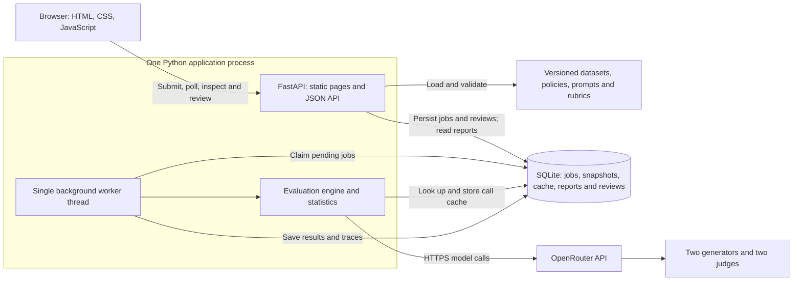

# SupportJudge

SupportJudge compares customer-support answers and tests how consistently LLM judges evaluate them. It generates two answers from the same question and policy evidence, asks two separate judges to score them, and preserves the decisions for inspection. Rubric experiments reuse those answers so a rubric edit can be evaluated without regenerating them.

The project focuses on LLMOps: versioned evaluation inputs, judge calibration, answer-order bias checks, reproducible reports, model-call traces, and release-gate logic. It uses fictional questions based on Dropbox individual-account policies and is not affiliated with Dropbox.

**Current release:** local application with 31 passing tests. A frozen configuration completed 30 held-out questions and 300 live model calls. Human review is implemented; independent calibration of that held-out run remains pending. No public deployment is currently published.

[Architecture](docs/architecture.md) · [Measurement report](reports/measurement-report.md) · [Dataset guide](docs/domain/dataset-guide.md) · [Team ownership](docs/team-distribution.md)

## What the app does

| Page | Purpose |
| --- | --- |
| New experiment | Choose two generators and two judges, edit generator prompts, select a dataset split, and start an evaluation. Judges can be chosen manually or rotated automatically. |
| Experiments | Browse saved runs and inspect answers, policy evidence, scores, verdicts, preferences, and explanations. Open a run to edit its saved rubric and create a separate rubric version. |
| Compare judges | Compare the two judges within one experiment. |
| Compare rubric versions | Match each judge across an original experiment and its revised-rubric version, using the same answers and evidence. |
| Human review | Collect blind reviews, finalize human decisions, and measure each judge's agreement with those decisions. |
| API reference | Explore the FastAPI endpoints at `/docs`. |

Generators write the answers. Judges evaluate both answers; they are not paired one-to-one with generators. Model selection excludes the exact generator model IDs from the chosen judges.

## Architecture



FastAPI serves the frontend and API. One worker thread processes queued jobs sequentially. SQLite stores the jobs, exact input snapshots, cached responses, completed reports, and human reviews. The evaluation engine validates structured judge output and computes statistics. See the [architecture document](docs/architecture.md) for request flow, failure handling, and design trade-offs.

## Run locally

Requires Python 3.11 or later, internet access, and an OpenRouter API key. Run commands from the repository root containing all workstreams.

```powershell
python -m venv .venv
.venv\Scripts\Activate.ps1
python -m pip install -e '.[dev]'
Copy-Item .env.example .env
```

Set these values in the local `.env` file:

```dotenv
OPENROUTER_API_KEY=your-key-here
SUPPORTJUDGE_CONFIG=openrouter.json
```

Start the app:

```powershell
python -m supportjudge_cli.cli serve --port 8017
```

Open <http://127.0.0.1:8017>. API documentation is at <http://127.0.0.1:8017/docs>. No Node build or team token is required. The app loads `.env` automatically, and Git ignores it. Saved experiments live in `work/supportjudge.db`, which Git also ignores. A fresh checkout starts with an empty experiment list.

This is a local, unauthenticated application. Reviewer names are self-declared. Public read/write hosting would require access controls. Use one application worker; multiple worker processes are not supported by the current job lifecycle.

The six workstream branches are currently separate and unmerged. Each contains its assigned component, not a standalone runnable app. The assembled local working copy contains all components; teammates should follow the handoff instructions when integrating their branches.

## Evaluation method

Each question supplies the same policy evidence to both generators and judges. Each judge performs four calls:

1. Score answer A independently on faithfulness, helpfulness, safety, and format adherence, each from 0 to 4, and return accept, reject, or insufficient evidence.
2. Score answer B in the same way.
3. Compare A with B and choose A, B, tie, or insufficient evidence.
4. Repeat the comparison with answer order reversed. Map the result back to the original answers and flag changed preferences.

With two generators and two judges, a new question requires ten model calls before caching. A rubric rerun needs eight judge calls per question and reuses the saved answers. Generator-prompt edits apply to new experiments only. Rubric edits apply equally to both judges in the new rubric version.

The report includes per-judge mean scores, paired score differences, and 95% bootstrap intervals using 1,000 question-level resamples with seed 42. Questions within a policy family are related; the intervals do not model that clustering or uncertainty across repeated model runs.

### Dataset and provenance

The versioned support dataset contains 60 scenarios:

| Split | Questions | Policy families |
| --- | --- | --- |
| Development | 30 | Cancellation, refunds, billing |
| Held out | 30 | Recovery, account access, support channels |

Evidence includes source URLs, retrieval dates, and provenance. The supplied scenarios and provisional reference labels are AI-authored. They do not establish handwritten dataset authorship or independent human calibration. The team owns the remaining handwritten evaluation-set evidence. See the [policy manifest](data/policies/manifest.json) and [dataset guide](docs/domain/dataset-guide.md).

Generated answers start unreviewed. The held-out results have now been inspected; future tuning on them cannot be presented as validation on an unseen set.

### Human review

Two people independently review the same saved answers under their own names. The blind page displays anonymous X/Y answers without judge verdicts or other reviewers' labels. The adjudication page aligns those answers to A/B, shows the original submissions, and records final verdicts, a preferred answer, and a reason. It does not require another username or choose a majority verdict automatically.

Judge agreement compares the saved AI decisions with the final human decisions for that exact experiment:

- Verdict agreement measures matching accept/reject decisions.
- Preference agreement measures matching choices of the better answer.
- False acceptance is the fraction of human-rejected answers accepted by a judge.
- False rejection is the fraction of human-accepted answers rejected by a judge.

Original reviews remain stored. Names do not authenticate reviewers or prove independence. Human-review metrics do not retroactively change an experiment report or approve a release.

## Measured results

Experiment 8 used GPT-4.1 mini and Gemini 2.5 Flash as generators, with Claude Haiku 4.5 and Mistral Small 3.2 as judges. The configuration was frozen from Experiment 5 before the held-out evaluation. Generator prompts differ, so these results compare answer configurations rather than model identity alone.

| Measurement | Observed result |
| --- | --- |
| Held-out questions / live calls / cache hits | 30 / 300 / 0 |
| Failed calls in this completed run | 0 |
| Total evaluation time | 978.8 seconds, about 16.3 minutes |
| Evaluation throughput | 1.839 questions per minute |
| Model-call latency p50 / p95 / p99 | 3.02 / 6.08 / 7.19 seconds |
| Per-question provider time p50 / p95 / p99 | 32.22 / 40.56 / 42.58 seconds |
| Tokens | 260,412 |
| Recorded API cost / cost per question | $0.011441 / $0.000381 |
| Submission benchmark | 100 requests, five concurrent clients, zero errors |
| Submission latency p50 / p95 / p99 | 31.9 / 48.6 / 51.7 ms |

The submission benchmark uses real HTTP validation and SQLite writes in a disposable local instance with model execution disabled. Evaluation throughput comes from the live single-worker run. Per-question provider time sums sequential model calls and excludes local processing; exact queue wait and full end-to-end per-question latency were not instrumented.

**Cost limitation:** Claude, Gemini, and GPT responses recorded zero cost despite nonzero token usage. The table preserves those reported values; it is not a reliable account-wide bill.

| Judge | A mean score / 4 | B mean score / 4 | Swapped-order consistency |
| --- | --- | --- | --- |
| Claude Haiku 4.5 | 3.958 | 3.900 | 80.0% |
| Mistral Small 3.2 | 3.983 | 3.933 | 66.7% |

High scores do not establish judge accuracy. Both judges sometimes changed preference when answer order changed. Independent human review of this run is still needed. Full intervals, limitations, and raw-data references are in the [measurement report](reports/measurement-report.md).

## Observability and reproducibility

Observability is implemented through saved traces and reports. Each completed run records model IDs, call latency, tokens, cost, cache hits, elapsed time, scores, explanations, configuration snapshots, dataset/settings hashes, Git revision, and an implementation hash. Cache hits record zero additional tokens and cost.

Inspect a run's `report.traces`, `report.metrics`, and `report.versions` through `GET /api/runs/{id}` or the downloadable experiment report. `GET /api/observability` summarizes the latest 100 runs, including job states, elapsed-time percentiles, token counts, and judge disagreements. Its category-shift statistic is descriptive, not a validated drift detector.

The [raw held-out run](reports/heldout-measurement-run.json), [measurement totals](reports/final-measurements.json), and [submission observations](reports/submission-measurements.json) are included as evidence. Traces are stored locally; there is no Langfuse service or alerting pipeline. Failed runs preserve an error state, but partial failed-call costs are not fully captured in completed reports.

Snapshots support auditing, not identical future outputs. Providers control model revisions and default sampling behavior.

## Tests, CLI and CI

```powershell
python -m pytest -q
python -m supportjudge_cli.cli evaluate --dataset support-v1 --split development --answers generate --output reports/live.json
```

The 31 tests cover evaluation behavior, provider response validation, API workflows, rubric comparisons, model selection, and human review. Tests use controlled test doubles and temporary databases without paid calls. The application and CLI run live models.

The CLI also accepts `--config measurement-v1` to use the frozen measured configuration. A new live evaluation may incur charges or reuse cached calls. To recreate the summary from the original local run:

```powershell
python infra/report_measurements.py c191bff6cdd247aaa4bfe94a82747bfa
```

That command requires the original SQLite run and saved submission measurements. The committed JSON evidence remains readable without the database. `python infra/measure_submission.py` reruns the isolated submission benchmark on port 8019.

GitHub Actions includes a test workflow and a manually dispatched remote-evaluation example. The CLI's `--gate` option exits with failure when calibration or regression checks are unmet. These checks have not been demonstrated as a required GitHub merge gate. The current measured run does not pass release approval. Promotion/activation endpoints exist, but calibrated promotion and deployment rollback have not been validated end to end.

## Repository map and scope

| Path | Contents |
| --- | --- |
| `apps/web/` | Static pages, navigation and client-side interactions |
| `services/api/` | FastAPI, worker thread, SQLite store and human review |
| `packages/evaluation/` | Provider calls, validation, model contracts and run engine |
| `packages/statistics/` | Scores, bootstrap intervals and gate calculations |
| `configs/` | Versioned model, prompt, rubric and release settings |
| `data/` | Policy provenance and evaluation scenarios |
| `infra/` | CLI, Dockerfile, report export and measurement scripts |
| `reports/` | Saved measurement evidence and report exports |
| `docs/` | Architecture, setup, dataset and team documentation |

V1 does not include model training, a retrieval pipeline, real customer-account actions, public deployment, live traffic monitoring, or automatic judge promotion. The architecture deliberately uses one Python process and SQLite for course-scale experiments. See [feature status](docs/feature-status.md) for remaining work. Presentation preparation and handwritten dataset evidence are team deliverables outside the implemented app.
