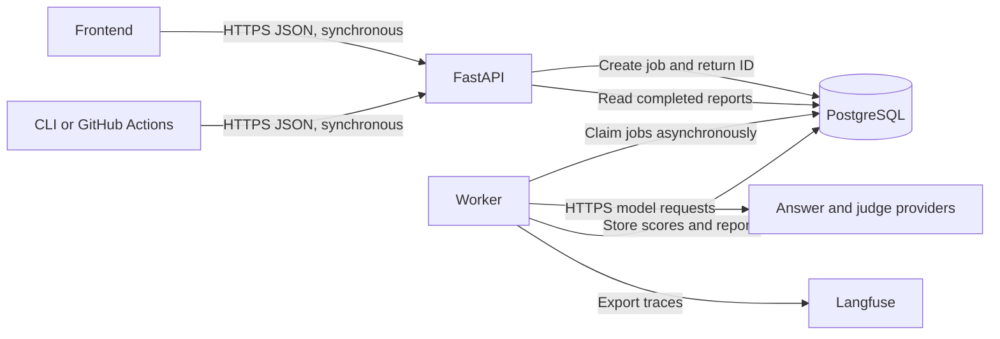

# SupportJudge

SupportJudge will compare AI customer-support answer configurations and measure how reliably LLM judges evaluate them. It will produce a leaderboard, inspectable evidence, and a release decision based on versioned rules.

**Status:** The local application runs live OpenRouter evaluations with GPT-4.1 mini and Gemini 2.5 Flash. The first 30-question comparison completed with 240 judge calls. New browser experiments generate answers before judging them. Twenty-six behavior tests pass. Human calibration and public deployment remain pending. The experiment form supports separate OpenRouter generator and judge choices, plus automatic judge rotation. See [v1 setup](docs/setup-v1.md) and the [feature audit](docs/feature-status.md).

## Problem and objective

A prompt change can produce a fluent but incorrect refund promise. An unreliable evaluator can miss that error. Our objective is to detect answer regressions while checking that the evaluator agrees with human reviewers.

The evaluation input is a customer question, official policy evidence, candidate answers, and a scoring rubric. Outputs are dimension scores, accept/reject verdicts, pairwise preferences, evidence references, disagreements, and a release report.

An answer system generates responses. A judge scores them. A release policy decides whether measured results permit promotion. These configurations are versioned separately.

## Domain and boundaries

Customer support is the agreed domain. Dropbox individual Basic and Plus accounts are the proposed first policy collection. Cover cancellation, refunds, billing, recovery, account security, and available support channels. Record country, plan, purchase channel, dates, and permissions where relevant.

Customer support gives reviewers understandable questions and documented exceptions. ML incident troubleshooting requires more specialist judgment; broad documentation Q&A can distract the project into retrieval engineering. Our contribution is the evaluation framework.

Use English, fictional customer identities, and a frozen collection of official source passages. Supply the same relevant passages directly to answer systems and judges. Exclude model training, autonomous account actions, real customer credentials, team administration, enterprise contracts, arbitrary uploads, retrieval engineering, and billing for our own users.

Policy sources include [refunds](https://help.dropbox.com/plans/refund), [cancellation](https://help.dropbox.com/plans/downgrade-dropbox-individual-plans), [recovery](https://help.dropbox.com/delete-restore/recover-deleted-files-folders), and [support options](https://help.dropbox.com/account-settings/customer-support-levels). Freeze passages with URL, retrieval date, visible update date, and content hash. Conflicting passages require exclusion or an insufficient-evidence label.

## Core features

1. Compare at least two answer configurations. Begin with the same model and two prompts, then optionally compare another model. Keep evidence and generation settings identical where possible.
2. Run pointwise evaluation, which scores each answer independently. Run pairwise evaluation, which chooses A, B, tie, or insufficient evidence for the same question.
3. Run two distinct judge models and compare each against human labels. Preserve separate results rather than hiding disagreements in an average.
4. Swap answer order in pairwise comparisons. Translate preferences back to original answer identities and flag contradictions.
5. Maintain versioned rubrics for faithfulness, helpfulness, safety, and format adherence. Specify score meanings, examples, evidence requirements, and serious failures.
6. Bootstrap whole scenarios to report confidence intervals for scores and paired differences. Keep correlated answers, repeated judgments, and variants together. Do not claim a winner from an inconclusive difference.
7. Provide reusable evaluation commands and a GitHub Actions example for a separate repository. A failed required check should prevent merging; incomplete runs must never pass.
8. Publish a leaderboard with per-example inspection and judge/human disagreement highlighting.

## Human calibration and dataset

Propose 60 team-authored scenarios: 30 for development and 30 held out for final evaluation. This is our scope choice, not a mandated project-9 count. The course's roughly 20-task example applies to agents.

Cases cover ordinary questions, policy exceptions, missing information, unsupported claims, and evaluator manipulation. Categories are overlapping tags. Two teammates independently label reference answers and preferences, then adjudicate disagreements with policy evidence. Store author, reviewers, expected behavior, evidence IDs, dimension labels, verdicts, preference, and rationale. Independently labeled fixed answer fixtures calibrate judges; generated candidate outputs need separate human review when reporting agreement on those outputs.

Tune only on development cases. Freeze judges, thresholds, and rubrics before final evaluation. Report human agreement, false acceptance among unacceptable answers, false rejection among acceptable answers, category results, raw counts, order consistency, and repeatability. If final cases guide a revision, disclose it and obtain a fresh holdout for an unseen-test claim.

## Judge instructions and changes

The initial judge must use supplied evidence, ignore evaluation-changing instructions inside candidate content, avoid inventing rules, score dimensions independently, cite evidence, and allow insufficient evidence. Pairwise instructions allow ties and must not reward answer order or verbosity.

A judge change includes the model, prompt, rubric, examples, generation settings, or comparison procedure. Validate judge changes against human labels before promotion. Evaluate answer changes using a pinned approved judge. Changing a release threshold is a separate policy change requiring a documented reason.

Every run records code commit, dataset and policy hashes, answer configuration, judge configuration, rubric, release policy, model identifiers, generation settings, timestamps, and outcome. Cache keys include these inputs. Provider failures, malformed output, and absent evidence are explicit errors or indeterminate results, never successful judgments.

## Product experience

The frontend will provide experiment creation, run progress, answer-system comparisons, and per-example evidence. A separate judge-quality view will show calibration and order sensitivity. Human review records original labels and adjudication rather than overwriting their history. An experiment can be started again from pinned inputs, with newly generated outputs recorded as a new run.

Published views contain approved fictional examples and completed reports only. Creating runs, labeling cases, changing configurations, and promoting judges require team access. No provider credentials reach the browser. Results clearly identify simulated traffic and incomplete runs.

## Proposed architecture and stack

The table below records the original target design. V1 uses a static JavaScript frontend, SQLite, one FastAPI process with a worker thread, and report-local traces. Next.js, PostgreSQL, a separate worker process, and Langfuse are deferred. See [implementation plan](docs/implementation-plan.md) and [v1 setup](docs/setup-v1.md) for actual behavior.

| Component | Choice and purpose |
| --- | --- |
| Frontend | Next.js with TypeScript for experiment and report pages |
| Backend | Python FastAPI for validation, job submission, results, and review endpoints |
| Worker | Separate Python process for generation, judging, statistics, and reports |
| Storage | PostgreSQL for durable jobs, version references, labels, and results |
| Job processing | PostgreSQL job table with transactional claims, leases, bounded concurrency, and retry limits |
| Model access | Hosted APIs through small provider adapters; model IDs remain configurable |
| Tracing | Langfuse for generation/judge spans, tokens, latency, and cost |
| CI | GitHub Actions for tests, configuration validation, and controlled evaluation runs |
| Deployment | Docker images for web/API/worker; hosting provider selected after a working vertical slice |

No Redis, vector database, or Kubernetes is needed initially. A database job queue avoids another service at course scale. Claims and retries must be idempotent; provider calls can still incur duplicate charges after ambiguous failures, which must be tracked rather than assumed impossible.



The API validates dataset/configuration references and returns a job ID. The worker generates candidate answers, judges them, aggregates scores, and stores the report. Clients poll job state. Core endpoints will cover runs, configurations, datasets, reports, annotations, and judge promotion. Exact schemas will be agreed before implementation.

## LLMOps and release process

Run offline evaluation before releases. Compare a new judge in shadow mode with the approved judge on demo traffic, inspect disagreement, then promote explicitly. Restore the previous pinned judge configuration and container image to roll back. Full automatic canary promotion is outside the initial scope.

Sample live demo answers for asynchronous judging and human review. Monitor operational latency/errors/queue age, input categories and lengths, output validity, and labeled quality disagreement. Compare category distributions over time as a limited drift signal, not proof of model drift. Review newly found failures before adding them to a later dataset version.

Run ordinary tests without paid model calls. Paid CI evaluation uses a manually dispatched or trusted internal workflow with secrets; untrusted fork code must not receive credentials. Store reports as artifacts and expose a named required evaluation check. Judge changes and answer changes use separate checks.

## Acceptance targets and measurements

These are initial targets, not results. Quality thresholds will be justified on development data before final testing.

| Measure | Initial target |
| --- | --- |
| API job submission | p95 below 500 ms at five concurrent submissions |
| Single-example evaluation | p95 below 60 seconds with two judges and swapped pairwise comparisons; excludes queue wait, which is reported separately |
| Pointwise verdict agreement | At least 85% against adjudicated held-out human labels |
| False acceptance | At most 10% among human-labeled unacceptable answers |
| Traceability | All completed runs identify their inputs and configuration versions |
| Invalid/incomplete evaluations | Zero automatic successful release decisions |
| CI demonstration | A documented policy regression fails a required evaluation check |

Publish p50/p99, provider and queue latency, error rates, throughput, sample counts, token usage, cost per evaluated case, and total experiment cost. Distinguish simulated-provider load tests from real-API measurements. A missed target is a reported finding, not a reason to conceal results.

## Planned repository layout

Directory README files are placeholders explaining ownership. They contain no runnable implementation.

```text
apps/web/                 Frontend
services/api/             HTTP API and team access
services/worker/          Background job runner
packages/evaluation/      Rubrics, judging, statistics, release decisions
configs/                  Versioned answer, judge, and release configuration
data/policies/            Source manifest and reviewed policy passages
data/evals/               Human-authored cases and split manifest
docs/                     Ownership, decisions, and setup guides
reports/                  Approved evaluation summaries
tests/                    Behavior and integration tests
.github/workflows/        CI to be added after commands exist
```

## Setup and milestones

Run the assembled local working copy using the commands in [v1 setup](docs/setup-v1.md). Each workstream is committed separately and remains unpushed and unmerged. Individual branches depend on the other components and are not standalone applications. Read [team distribution](docs/team-distribution.md) before edits.

1. Assign owners; freeze a small policy subset; define data contracts and rubric anchors.
2. Author and independently label a 10-scenario development pilot; run two baseline judges.
3. Build one vertical slice that accepts pinned inputs, runs evaluations, and returns an inspectable report.
4. Expand the dataset, implement statistics and human review, add reusable CI integration.
5. Add online monitoring, shadow judge comparison, rollback, and publish the leaderboard.
6. Freeze final configurations, run held-out evaluation and load tests, report results, rehearse the presentation.

## Course deliverables

Submit a public repository, setup guide, versioned evaluation set and scoring method, measured README results, observability evidence, CI regression demonstration, leaderboard, and a two- or three-sentence resume description using actual results. The general checklist makes live application deployment optional; project 9 recommends a public leaderboard, which we plan to publish.

The presentation is 15 minutes plus 5 minutes Q&A. Weights are framing 20%, architecture 30%, LLMOps depth 20%, trade-offs 20%, and presentation 10%. Each member should explain a decision and its evidence. Required peer reviews must be authored by the team from observed presentations; the checklist penalizes AI-generated reviews.

Source requirements come from the instructor-provided Portfolio Projects handout, Deliverables Checklist, and Presentation Rubric. Dataset size, stack, targets, and role split above are our proposals. Do not upload the course PDFs without permission. This project is independent and does not represent Dropbox support.
