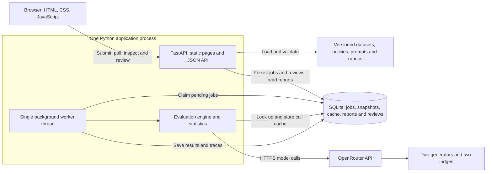
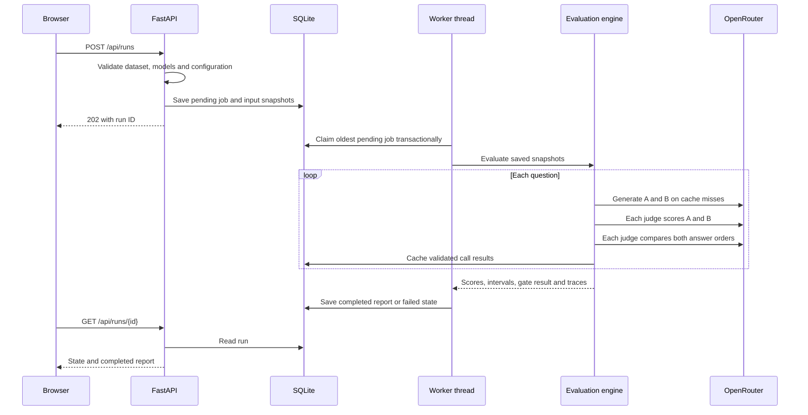
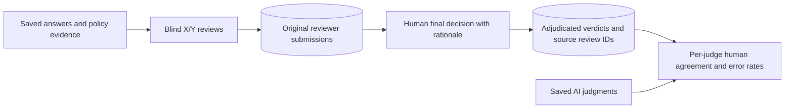

# SupportJudge architecture

This document describes the implemented local application. The diagram in the README is the same deployment view. Earlier planning documents include future components that are not part of V1.

## Deployment view

The frontend uses plain JavaScript and browser fetch calls. FastAPI serves both static files and JSON endpoints. Provider credentials come from the local environment and are used only by the Python model client.

The worker is a thread inside the API process, implemented in `services/api/supportjudge_api/api.py`. It is not a separate deployed service. `services/worker/` is an ownership placeholder. SQLite replaces the PostgreSQL queue proposed during planning; Next.js and Langfuse are not dependencies.

## Experiment lifecycle

The queue allows at most ten pending or running jobs. A single worker claims jobs with a SQLite transaction. It polls every 250 ms when idle. Jobs progress from pending to running to completed or failed. On startup, previously running jobs are marked failed; pending jobs remain queued. There are no automatic provider retries.

Each provider call checks a cache key derived from the model configuration, instruction, payload, output schema, evaluation mode and settings hash. Uncached responses must pass JSON/schema validation and reference known evidence IDs before they enter the cache. A provider or validation failure stops the run and does not approve a release.

## Rubric versions

`POST /api/runs/{id}/rubric-comparisons` creates a child experiment from a completed baseline. It freezes the generated answers, evidence and judge models and stores the edited rubric in a new settings snapshot. It also stores the baseline link and rubric-change name. No generator calls are needed for this workflow.

The comparison page matches case IDs and judge IDs across the saved versions. It reports changed score descriptions, scores, preferences and explanations. Model sampling can still change judgments; a single rerun does not isolate all randomness.

## Human review

Blind answer order is stable for a run, question and reviewer name. At least two distinct reviewer names must submit before a question can be finalized. Names are self-declared; the software cannot establish that two people acted independently. Adjudication requires verdicts, a preference and a reason, but no extra username. Original submissions remain immutable.

The saved answer/evidence hash prevents reviews from being applied to changed content. Metrics use final decisions for the selected run only. They do not overwrite its original report, transfer to another experiment, or activate a release. The UI shows aggregate human agreement; a per-answer human-versus-judge comparison table is not implemented.

## Storage and interfaces

| Component | Stored or exposed data |
| --- | --- |
| Versioned JSON files | Dataset, policy provenance, prompts, model settings and rubric descriptions |
| SQLite runs | State, request snapshots, report, error and creation timestamp |
| SQLite cache | Validated call output and its original trace |
| Human-review tables | Reviewer submissions, final decisions, evidence hashes and source review links |
| Completed report | Answer text, judge scores/reasons, preferences, order consistency, statistics, traces and version identifiers |
| `/api/observability` | Latest 100-run state counts, elapsed-time percentiles, reported tokens and disagreements |
| CLI | Calls the evaluation engine directly; it does not submit to the background queue |
| Remote CI example | Submits to an accessible service, polls completion, and checks the saved release gate |

For exact request schemas, run the app and open `/docs`. The remote CI example requires a separately reachable service; localhost on a developer laptop is not accessible from GitHub-hosted runners.

## Design choices and limits

- One process and SQLite keep setup small and make snapshots and reviews persistent. They limit throughput and do not provide a distributed queue. Use one application worker.
- Policy passages are supplied directly. This keeps the experiment focused on judge behavior rather than retrieval quality.
- Each judge evaluates both answers and both orders. This costs eight judge calls per question but makes order sensitivity observable.
- Local traces provide the project's observability evidence without another service. Exact queue timing, complete failed-call billing and alerting remain absent.
- Configuration snapshots and hashes support audits. They cannot pin provider internals or guarantee deterministic responses.
- The local API has no authentication. Public deployment and a required GitHub merge gate are not part of the measured setup.

The frozen live study and submission benchmark are documented in [the measurement report](../reports/measurement-report.md). They establish local measurements, not production capacity or independently verified judge accuracy.
